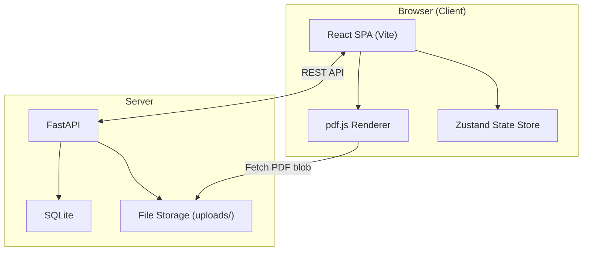
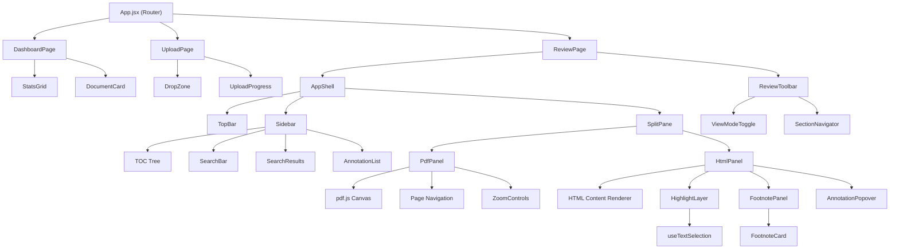
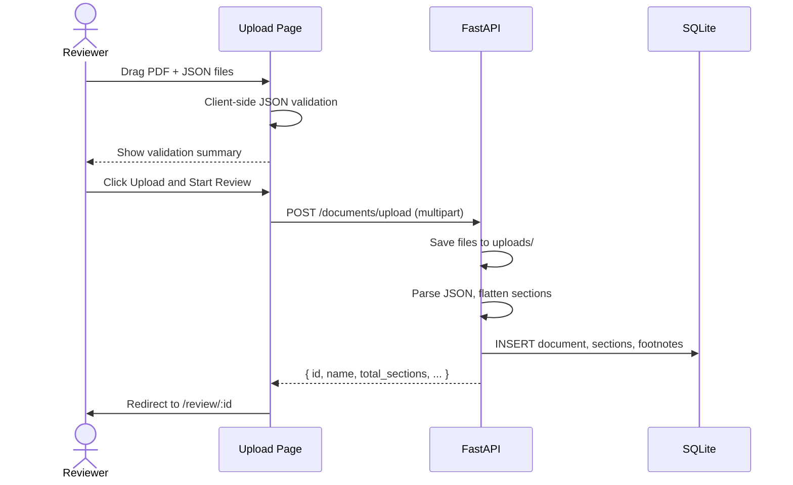
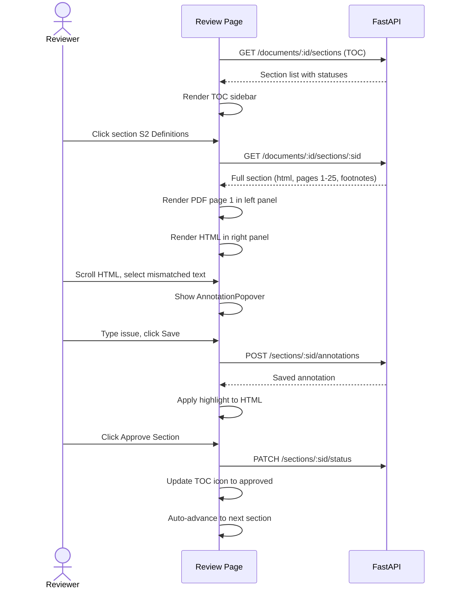
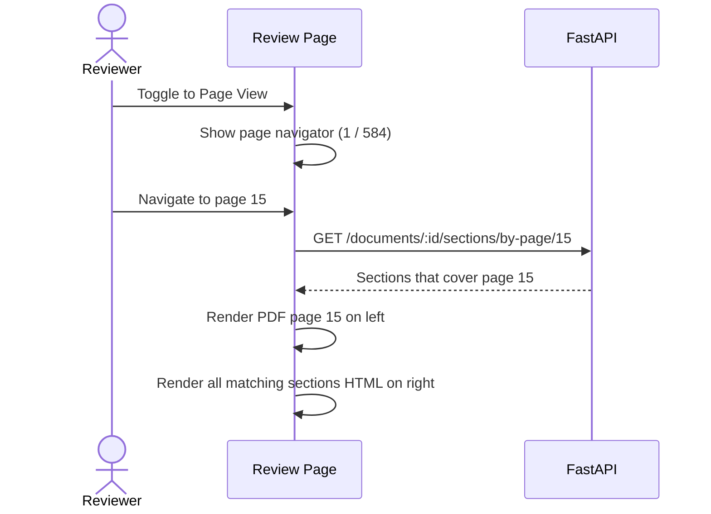
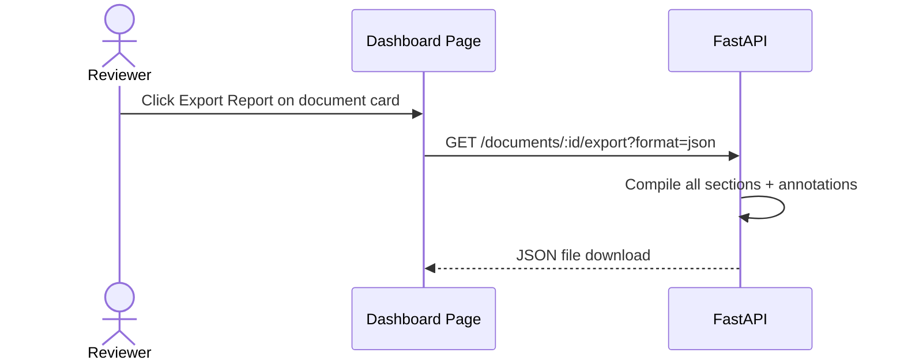

# PDF-QA Validation Portal — Design Document

> **Purpose**: A web portal for the QA team to validate PDF-to-HTML parsing accuracy of legal documents (e.g., Pakistan Income Tax Ordinance). Reviewers upload a PDF + enriched JSON pair, then compare the original PDF rendering against the parsed HTML output side-by-side, section-by-section and page-by-page, flagging any discrepancies with inline annotations.

---

## Table of Contents

- [1. Requirements Summary](#1-requirements-summary)
- [2. System Architecture](#2-system-architecture)
- [3. Technology Stack](#3-technology-stack)
- [4. Data Model](#4-data-model)
- [5. Project Structure](#5-project-structure)
- [6. Screens & Wireframes](#6-screens--wireframes)
- [7. Component Architecture](#7-component-architecture)
- [8. API Contract](#8-api-contract)
- [9. User Flows](#9-user-flows)
- [10. State Management](#10-state-management)
- [11. PDF Rendering Strategy](#11-pdf-rendering-strategy)
- [12. Inline Highlighting & Annotation System](#12-inline-highlighting--annotation-system)
- [13. Footnote Validation Panel](#13-footnote-validation-panel)
- [14. Search System](#14-search-system)
- [15. Progress Tracking & Dashboard](#15-progress-tracking--dashboard)
- [16. Theme System](#16-theme-system)
- [17. Export System](#17-export-system)
- [18. Performance Considerations](#18-performance-considerations)
- [19. Implementation Phases](#19-implementation-phases)

---

## 1. Requirements Summary

| Requirement | Decision |
|---|---|
| Portal scope | Multi-document — upload many PDF+JSON pairs over time |
| Architecture | Client-server (lightweight backend) |
| Comparison modes | Both section-level AND page-level, with toggle |
| QA annotations | Inline text highlighting + issue descriptions |
| PDF rendering | pdf.js (client-side, vector canvas rendering) |
| Progress persistence | Yes — resume from where you left off + progress dashboard |
| Authentication | None — small team (2-3 reviewers) |
| JSON schema | Fixed schema: `chapters[] → parts[]/divisions[] → sections[]` |
| Frontend | Vite + React |
| Backend | Python FastAPI |
| Storage | SQLite |
| Navigation features | TOC sidebar, full-text search, footnote validation panel |
| Theme | Dark + Light with toggle |
| Export | QA report as CSV/JSON |

---

## 2. System Architecture



### Architecture Principles

1. **PDF stays on server disk** — uploaded once, served as a static file. pdf.js fetches pages on demand.
2. **JSON parsed on upload** — FastAPI reads the JSON, creates the document record and section inventory in SQLite.
3. **Annotations are server-persisted** — every highlight/issue is saved immediately via API, so reviewers never lose work.
4. **Frontend is stateless on reload** — all review state comes from the API; the React app is a pure view layer.

---

## 3. Technology Stack

### Frontend
| Layer | Technology | Rationale |
|---|---|---|
| Build tool | **Vite 6** | Instant HMR, fast builds |
| UI framework | **React 19** | Component model fits the complex dual-panel layout |
| State management | **Zustand** | Lightweight, no boilerplate, perfect for mid-complexity state |
| PDF rendering | **pdf.js (pdfjs-dist)** | Industry-standard, renders vector PDFs in canvas, supports zoom/pan |
| HTTP client | **fetch (native)** | Simple REST calls, no need for Axios |
| Routing | **React Router v7** | Multi-page SPA (upload, review, dashboard) |
| Styling | **Vanilla CSS with CSS custom properties** | Theme toggle via CSS variables, full control |
| Icons | **Lucide React** | Clean, consistent icon set |
| Fonts | **Inter (Google Fonts)** | Excellent readability for dense legal text |

### Backend
| Layer | Technology | Rationale |
|---|---|---|
| Framework | **FastAPI** | Async, auto-generated OpenAPI docs, fast |
| Database | **SQLite via aiosqlite** | Zero-config, file-based, perfect for small teams |
| ORM | **None — raw SQL via aiosqlite** | Simple schema, raw SQL is clearer |
| File handling | **python-multipart** | For PDF/JSON file uploads |
| CORS | **fastapi.middleware.cors** | Dev-mode cross-origin for Vite dev server |
| Server | **Uvicorn** | ASGI server for FastAPI |

---

## 4. Data Model

### SQLite Schema

```sql
-- A document pair (one PDF + one JSON upload)
CREATE TABLE documents (
    id            TEXT PRIMARY KEY,  -- UUID
    name          TEXT NOT NULL,     -- Display name (e.g., "Income Tax Ordinance 2018")
    pdf_filename  TEXT NOT NULL,     -- Stored filename on disk
    json_filename TEXT NOT NULL,     -- Stored filename on disk
    total_sections INTEGER NOT NULL, -- Pre-computed from JSON
    total_pages   INTEGER NOT NULL,  -- Pre-computed from PDF (pdf page count)
    uploaded_at   TEXT NOT NULL,     -- ISO 8601 timestamp
    status        TEXT NOT NULL DEFAULT 'pending'  -- 'pending' | 'in_progress' | 'completed'
);

-- Flattened section index (denormalized from the JSON hierarchy)
CREATE TABLE sections (
    id            TEXT PRIMARY KEY,  -- UUID
    document_id   TEXT NOT NULL REFERENCES documents(id) ON DELETE CASCADE,
    chapter_code  TEXT,              -- e.g., "CHAPTER 1"
    chapter_heading TEXT,
    part_code     TEXT,              -- e.g., "PART I" (nullable)
    part_heading  TEXT,
    division_code TEXT,              -- e.g., "DIVISION I" (nullable)
    division_heading TEXT,
    section_code  TEXT NOT NULL,     -- e.g., "2"
    section_heading TEXT NOT NULL,   -- e.g., "Definitions"
    start_page    INTEGER,          -- PDF page (1-indexed)
    end_page      INTEGER,          -- PDF page (1-indexed)
    html_content  TEXT,             -- The parsed HTML
    plain_text    TEXT,             -- The plain text version
    sort_order    INTEGER NOT NULL, -- For deterministic ordering
    review_status TEXT NOT NULL DEFAULT 'pending'  
                                   -- 'pending' | 'approved' | 'has_issues'
);

-- Footnotes for each section
CREATE TABLE footnotes (
    id            TEXT PRIMARY KEY,
    section_id    TEXT NOT NULL REFERENCES sections(id) ON DELETE CASCADE,
    marker        TEXT NOT NULL,    -- e.g., "1", "*"
    page          INTEGER,         -- PDF page where footnote appears
    text          TEXT NOT NULL,    -- Footnote content
    review_status TEXT NOT NULL DEFAULT 'pending'
                                   -- 'pending' | 'approved' | 'has_issues'
);

-- Inline annotations (highlights with issue descriptions)
CREATE TABLE annotations (
    id            TEXT PRIMARY KEY,  -- UUID
    section_id    TEXT NOT NULL REFERENCES sections(id) ON DELETE CASCADE,
    highlighted_text TEXT NOT NULL,  -- The selected text
    start_offset  INTEGER NOT NULL, -- Character offset in the HTML content
    end_offset    INTEGER NOT NULL,
    issue_description TEXT,         -- Reviewer's note about what's wrong
    severity      TEXT NOT NULL DEFAULT 'error',  -- 'error' | 'warning' | 'info'
    created_at    TEXT NOT NULL,    -- ISO 8601
    reviewer_name TEXT              -- Optional: who flagged it
);

-- Indexes for fast queries
CREATE INDEX idx_sections_document ON sections(document_id);
CREATE INDEX idx_sections_pages ON sections(document_id, start_page, end_page);
CREATE INDEX idx_footnotes_section ON footnotes(section_id);
CREATE INDEX idx_annotations_section ON annotations(section_id);
```

### JSON Schema (Input)

The portal expects this exact schema from the uploaded JSON:

```
{
  "chapters": [
    {
      "code": "CHAPTER 1",
      "heading": "PRELIMINARY",
      "parts": [...],
      "divisions": [...],
      "sections": [
        {
          "code": "1",
          "heading": "Short title, extent and commencement",
          "page_number": 1,
          "html": "<h4>...</h4><p>...</p>",
          "plain_text": "1. Short title...",
          "start_page": 1,
          "end_page": 1,
          "footnotes": [
            { "id": "p1-*", "page": 1, "marker": "*", "text": "..." }
          ]
        }
      ]
    }
  ],
  "schedules": [
    {
      "code": "FIRST SCHEDULE",
      "heading": "...",
      "page_number": 389,
      "parts": [...],
      "sections": [...]
    }
  ]
}
```

### Flattening Algorithm

On upload, the backend walks the JSON tree and produces a flat sections list:

```
for each chapter:
    for each section in chapter.sections:
        INSERT into sections (chapter context + section data)
    for each part in chapter.parts:
        for each section in part.sections:
            INSERT into sections (chapter + part context + section data)
    for each division in chapter.divisions:
        for each section in division.sections:
            INSERT into sections (chapter + division context + section data)
for each schedule:
    (same logic — schedules can have parts or sections directly)
```

This gives a **flat, ordered list** of ~299 sections per document, each with its chapter/part/division context attached.

---

## 5. Project Structure

```
PDF-QA-Portal/
├── Assets/                          # Sample data (existing)
│   ├── Income Tax Ordinance...pdf
│   └── ordinance-2018-enriched.json
│
├── backend/
│   ├── main.py                      # FastAPI app entry point
│   ├── database.py                  # SQLite init, connection, migrations
│   ├── models.py                    # Pydantic response models
│   ├── routes/
│   │   ├── documents.py             # Upload, list, delete documents
│   │   ├── sections.py              # Get sections, update review status
│   │   ├── annotations.py           # CRUD for inline annotations
│   │   ├── footnotes.py             # Footnote review endpoints
│   │   ├── search.py                # Full-text search endpoint
│   │   └── export.py                # Export QA report as CSV/JSON
│   ├── services/
│   │   ├── json_parser.py           # Flatten JSON -> sections + footnotes
│   │   └── pdf_service.py           # Extract PDF page count
│   ├── uploads/                     # Stored PDF and JSON files
│   ├── data/
│   │   └── qa_portal.db             # SQLite database file
│   └── requirements.txt
│
├── frontend/
│   ├── index.html
│   ├── vite.config.js
│   ├── package.json
│   ├── public/
│   │   └── favicon.svg
│   ├── src/
│   │   ├── main.jsx                 # App entry
│   │   ├── App.jsx                  # Router setup
│   │   ├── index.css                # Global styles + CSS custom properties
│   │   ├── theme.css                # Dark/light theme variables
│   │   │
│   │   ├── stores/
│   │   │   ├── documentStore.js     # Zustand: active document state
│   │   │   ├── reviewStore.js       # Zustand: annotations, review status
│   │   │   └── uiStore.js           # Zustand: theme, view mode, sidebar
│   │   │
│   │   ├── pages/
│   │   │   ├── UploadPage.jsx       # Upload PDF + JSON
│   │   │   ├── DashboardPage.jsx    # Document list + progress overview
│   │   │   └── ReviewPage.jsx       # The main review workspace
│   │   │
│   │   ├── components/
│   │   │   ├── layout/
│   │   │   │   ├── AppShell.jsx     # Top bar + sidebar + content layout
│   │   │   │   ├── TopBar.jsx       # Logo, theme toggle, navigation
│   │   │   │   └── Sidebar.jsx      # TOC tree + search
│   │   │   │
│   │   │   ├── upload/
│   │   │   │   ├── DropZone.jsx     # Drag-and-drop file upload
│   │   │   │   └── UploadProgress.jsx
│   │   │   │
│   │   │   ├── review/
│   │   │   │   ├── SplitPane.jsx    # Resizable left/right split container
│   │   │   │   ├── PdfPanel.jsx     # Left panel: pdf.js canvas renderer
│   │   │   │   ├── HtmlPanel.jsx    # Right panel: rendered parsed HTML
│   │   │   │   ├── ViewModeToggle.jsx  # Section view / Page view toggle
│   │   │   │   ├── SectionNavigator.jsx # Prev/Next section controls
│   │   │   │   └── ReviewToolbar.jsx    # Approve/Flag section, zoom controls
│   │   │   │
│   │   │   ├── annotations/
│   │   │   │   ├── HighlightLayer.jsx   # Text selection -> highlight overlay
│   │   │   │   ├── AnnotationPopover.jsx # Issue description form
│   │   │   │   └── AnnotationList.jsx    # Sidebar list of all annotations
│   │   │   │
│   │   │   ├── footnotes/
│   │   │   │   ├── FootnotePanel.jsx     # Expandable footnote validation view
│   │   │   │   └── FootnoteCard.jsx      # Individual footnote review card
│   │   │   │
│   │   │   ├── search/
│   │   │   │   ├── SearchBar.jsx         # Full-text search input
│   │   │   │   └── SearchResults.jsx     # Results list with context snippets
│   │   │   │
│   │   │   ├── dashboard/
│   │   │   │   ├── DocumentCard.jsx      # Document summary card
│   │   │   │   ├── ProgressRing.jsx      # Circular progress indicator
│   │   │   │   └── StatsGrid.jsx         # Key metrics grid
│   │   │   │
│   │   │   └── common/
│   │   │       ├── Button.jsx
│   │   │       ├── Badge.jsx
│   │   │       ├── Modal.jsx
│   │   │       └── Tooltip.jsx
│   │   │
│   │   ├── hooks/
│   │   │   ├── usePdfRenderer.js    # pdf.js initialization and page rendering
│   │   │   ├── useTextSelection.js  # Track text selection for highlighting
│   │   │   ├── useKeyboardNav.js    # Keyboard shortcut handling
│   │   │   └── useDebounce.js       # Debounced search input
│   │   │
│   │   └── utils/
│   │       ├── api.js               # API client wrapper
│   │       ├── formatters.js        # Date, percentage formatters
│   │       └── constants.js         # Route paths, API base URL
│   │
│   └── .env                         # VITE_API_URL=http://localhost:8000
│
├── design.md                        # This document
└── README.md                        # Setup and usage instructions
```

---

## 6. Screens and Wireframes

### Screen 1: Dashboard (Landing Page)

```
┌──────────────────────────────────────────────────────────────────────┐
│  PDF-QA Portal                                       [☀/🌙] [Upload]│
├──────────────────────────────────────────────────────────────────────┤
│                                                                      │
│  Overview                                                            │
│  ┌────────────┐  ┌────────────┐  ┌────────────┐  ┌────────────┐    │
│  │  Documents  │  │  Sections  │  │   Issues   │  │  Completed │    │
│  │     12      │  │  3,240     │  │    47      │  │    68%     │    │
│  └────────────┘  └────────────┘  └────────────┘  └────────────┘    │
│                                                                      │
│  Documents                                        [Sort ▾] [Filter] │
│  ┌────────────────────────────────────────────────────────────────┐  │
│  │  Income Tax Ordinance, 2001 (Amended 2018)                    │  │
│  │    299 sections · 584 pages · Uploaded Jun 22                  │  │
│  │    ████████████████████░░░░░  78% reviewed · 12 issues        │  │
│  │                                              [Continue Review] │  │
│  ├────────────────────────────────────────────────────────────────┤  │
│  │  Sales Tax Act, 1990                                          │  │
│  │    156 sections · 312 pages · Uploaded Jun 23                  │  │
│  │    ░░░░░░░░░░░░░░░░░░░░░░░░  0% reviewed · 0 issues          │  │
│  │                                              [Start Review]   │  │
│  └────────────────────────────────────────────────────────────────┘  │
│                                                                      │
└──────────────────────────────────────────────────────────────────────┘
```

**Key elements:**
- Stats grid at top: total documents, total sections, total issues, completion %
- Document cards with progress bars and quick-action buttons
- Upload button in the top bar

---

### Screen 2: Upload Page

```
┌──────────────────────────────────────────────────────────────────────┐
│  PDF-QA Portal                                       [☀/🌙] [Back] │
├──────────────────────────────────────────────────────────────────────┤
│                                                                      │
│         ┌─────────────────────────────────────────────┐              │
│         │                                             │              │
│         │       Drop your PDF file here               │              │
│         │         or click to browse                  │              │
│         │                                             │              │
│         │      ✅ Income_Tax_Ordinance.pdf  (5.9 MB)  │              │
│         │                                             │              │
│         └─────────────────────────────────────────────┘              │
│                                                                      │
│         ┌─────────────────────────────────────────────┐              │
│         │                                             │              │
│         │       Drop your JSON file here              │              │
│         │         or click to browse                  │              │
│         │                                             │              │
│         │      ✅ ordinance-2018-enriched.json (3 MB) │              │
│         │                                             │              │
│         └─────────────────────────────────────────────┘              │
│                                                                      │
│         Document Name: [Income Tax Ordinance, 2001      ]           │
│                                                                      │
│         ┌─────────────────────────────────────────────┐              │
│         │  Validation Summary                         │              │
│         │  ✅ JSON schema valid                       │              │
│         │  ✅ 13 chapters, 299 sections found         │              │
│         │  ✅ Page references: 1-377                  │              │
│         │  ✅ 267 sections have HTML content           │              │
│         │  ⚠  32 sections missing HTML (schedules)    │              │
│         └─────────────────────────────────────────────┘              │
│                                                                      │
│                              [ Upload and Start Review ]             │
│                                                                      │
└──────────────────────────────────────────────────────────────────────┘
```

**Key elements:**
- Two separate drop zones for PDF and JSON
- Pre-upload JSON validation with summary stats
- Document name auto-populated from JSON content
- Clear feedback on what was detected

---

### Screen 3: Review Workspace (Main Screen)

```
┌──────────────────────────────────────────────────────────────────────────────────────┐
│  PDF-QA Portal  │ Income Tax Ordinance, 2001   [Section / Page] [68%]  [☀/🌙]      │
├────────────────┬─────────────────────────────────────────────────────────────────────┤
│ TOC            │  ┌─────────────────────────┬──────────────────────────────────┐    │
│                │  │     PDF ORIGINAL         │      PARSED HTML                 │    │
│ [Search...]    │  │                          │                                  │    │
│                │  │  ┌─────────────────────┐  │  ┌────────────────────────────┐  │    │
│ ▼ CH 1         │  │  │                     │  │  │                            │  │    │
│   ✅ S1 Short  │  │  │   PDF page canvas   │  │  │  2. Definitions            │  │    │
│   ⚠ S2 Defn.. │  │  │   rendered by        │  │  │  In this Ordinance,       │  │    │
│ ▼ CH 2         │  │  │   pdf.js             │  │  │  unless there is anything │  │    │
│   ⬜ S3 ...    │  │  │                     │  │  │  repugnant in the subject │  │    │
│   ⬜ S4 ...    │  │  │   [Page 1 of 25]    │  │  │  or context —             │  │    │
│ ▼ CH 3         │  │  │                     │  │  │  (1) "accumulated profits" │  │    │
│   ...          │  │  │                     │  │  │  ==highlighted issue==     │  │    │
│                │  │  │                     │  │  │  in relation to...         │  │    │
│ ▼ SCHEDULES    │  │  │                     │  │  │                            │  │    │
│   ...          │  │  └─────────────────────┘  │  └────────────────────────────┘  │    │
│                │  │  [< Prev Page] [1/25] [Next Page >]                          │    │
│                │  │                          │  ┌────────────────────────────┐    │    │
│                │  │  [Zoom+] [Zoom-] [Fit]   │  │ Footnotes (3)              │    │    │
│                │  │                          │  │  1. Inserted by Finance...  │    │    │
│                │  │                          │  │  2. The word "includes"...  │    │    │
│────────────────│  │                          │  │  3. Inserted by Finance...  │    │    │
│ Annotations    │  │                          │  └────────────────────────────┘    │    │
│                │  ├──────────────────────────┴──────────────────────────────────┤    │
│ 1. "accum..."  │  │ [✅ Approve Section]  [⚠ Flag Issues]  [< Prev] [Next >]  │    │
│    Missing text │  └────────────────────────────────────────────────────────────┘    │
│ 2. "amalg..."  │                                                                     │
│    Wrong format │                                                                     │
└────────────────┴─────────────────────────────────────────────────────────────────────┘
```

**Key areas:**
1. **Left Sidebar (260px)**: Collapsible TOC tree with review status icons + annotation list
2. **Left Panel (~50%)**: PDF rendered via pdf.js with zoom controls and page navigation
3. **Right Panel (~50%)**: Parsed HTML with inline highlight overlays + footnotes panel below
4. **Bottom Toolbar**: Section approve/flag actions + prev/next navigation

---

## 7. Component Architecture



### Component Responsibilities

| Component | Responsibility |
|---|---|
| AppShell | Three-column layout: sidebar + main content. Handles responsive resizing. |
| Sidebar | Houses the TOC tree, search, and annotation list. Collapsible. |
| SplitPane | Horizontally resizable container for PDF and HTML panels. Drag handle in the middle. |
| PdfPanel | Manages a canvas element, renders PDF pages via pdf.js. Handles zoom, page navigation. |
| HtmlPanel | Renders the section's HTML via dangerouslySetInnerHTML. Applies highlight overlays. Hosts the footnote panel. |
| HighlightLayer | Listens for mouseup events on the HTML panel. When text is selected, creates a highlight mark element and opens the AnnotationPopover. |
| AnnotationPopover | Floating form near the highlight: issue description textarea, severity selector, save/cancel buttons. |
| FootnotePanel | Expandable section below the HTML content showing all footnotes for the current section. Each footnote has approve/flag controls. |
| ViewModeToggle | Switches between Section View (navigate by section, show all pages for that section) and Page View (navigate by page, show all sections that map to that page). |

---

## 8. API Contract

### Base URL: `http://localhost:8000/api`

### Documents

```
POST   /documents/upload
       Body: multipart/form-data { pdf: File, json: File, name: string }
       Response: { id, name, total_sections, total_pages, uploaded_at }
       Side-effect: Parses JSON, creates sections + footnotes in DB

GET    /documents
       Response: [{ id, name, total_sections, total_pages, uploaded_at, status,
                     stats: { reviewed, approved, has_issues, pending } }]

GET    /documents/:id
       Response: { id, name, total_sections, total_pages, uploaded_at, status,
                   stats: { reviewed, approved, has_issues, pending } }

DELETE /documents/:id
       Side-effect: Deletes DB records + files from disk
```

### Sections

```
GET    /documents/:id/sections
       Response: [{ id, chapter_code, chapter_heading, part_code, part_heading,
                     division_code, division_heading, section_code, section_heading,
                     start_page, end_page, review_status, annotation_count, sort_order }]
       Note: Does NOT include html_content or plain_text (for performance)

GET    /documents/:id/sections/:section_id
       Response: { ...full section data including html_content, plain_text, footnotes[] }

GET    /documents/:id/sections/by-page/:page_number
       Response: [{ ...sections that cover this page }]
       Note: Used in Page View mode

PATCH  /documents/:id/sections/:section_id/status
       Body: { review_status: "approved" | "has_issues" | "pending" }
       Response: { id, review_status }
```

### Annotations

```
GET    /sections/:section_id/annotations
       Response: [{ id, highlighted_text, start_offset, end_offset,
                     issue_description, severity, created_at, reviewer_name }]

POST   /sections/:section_id/annotations
       Body: { highlighted_text, start_offset, end_offset, issue_description,
               severity, reviewer_name }
       Response: { id, ...created annotation }

DELETE /annotations/:id
       Response: 204

PATCH  /annotations/:id
       Body: { issue_description?, severity? }
       Response: { id, ...updated annotation }
```

### Footnotes

```
PATCH  /footnotes/:id/status
       Body: { review_status: "approved" | "has_issues" | "pending" }
       Response: { id, review_status }
```

### Search

```
GET    /documents/:id/search?q=<query>&limit=50
       Response: [{ section_id, section_code, section_heading, chapter_code,
                     snippet, match_count }]
       Note: Searches plain_text column using SQLite FTS or LIKE
```

### Export

```
GET    /documents/:id/export?format=json
GET    /documents/:id/export?format=csv
       Response: Downloadable file with all sections, their review status,
                 and all annotations
```

### Static Files

```
GET    /uploads/:filename
       Response: The raw PDF or JSON file (served as static files by FastAPI)
```

---

## 9. User Flows

### Flow 1: Upload and Start Review



### Flow 2: Section-by-Section Review



### Flow 3: Page View Mode



### Flow 4: Export QA Report



---

## 10. State Management

### Zustand Stores

#### documentStore.js
```
State:
  - documents[]              // All uploaded documents
  - activeDocumentId         // Currently selected document
  - sections[]               // Sections for active document (TOC data, no HTML)
  - activeSection            // Full section data (with HTML, footnotes)
  - loading                  // Loading states

Actions:
  - fetchDocuments()
  - fetchSections(docId)
  - fetchSection(docId, sectionId)
  - fetchSectionsByPage(docId, pageNumber)
  - uploadDocument(pdf, json, name)
  - deleteDocument(docId)
```

#### reviewStore.js
```
State:
  - annotations[]            // Annotations for active section
  - pendingHighlight          // Text selection in progress
  - viewMode                  // 'section' | 'page'
  - currentPage               // Current PDF page number
  
Actions:
  - fetchAnnotations(sectionId)
  - createAnnotation(sectionId, data)
  - deleteAnnotation(annotationId)
  - updateAnnotation(annotationId, data)
  - updateSectionStatus(sectionId, status)
  - updateFootnoteStatus(footnoteId, status)
  - setViewMode(mode)
  - setCurrentPage(page)
```

#### uiStore.js
```
State:
  - theme                     // 'dark' | 'light'
  - sidebarOpen               // boolean
  - sidebarTab                // 'toc' | 'search' | 'annotations'
  - splitRatio                // 0.5 default (50/50 split)
  - pdfZoom                   // 1.0 default

Actions:
  - toggleTheme()
  - toggleSidebar()
  - setSidebarTab(tab)
  - setSplitRatio(ratio)
  - setPdfZoom(zoom)
```

---

## 11. PDF Rendering Strategy

### pdf.js Integration

```
Initialization Flow:
1. On ReviewPage mount, load pdf.js worker
2. Fetch PDF from /uploads/:filename
3. pdfjsLib.getDocument(url) returns PDFDocumentProxy
4. Cache the document proxy in a ref

Page Rendering Flow:
1. Section selected, get start_page
2. pdfDoc.getPage(pageNum) returns PDFPageProxy
3. page.getViewport({ scale: pdfZoom })
4. page.render({ canvasContext, viewport })
5. Display on canvas element

Zoom Behavior:
- Default: Fit Width (calculate scale from container width)
- Zoom In/Out: +/- 0.25 increments
- Min: 0.5, Max: 3.0
```

### Page Navigation in Section View

When viewing a multi-page section (e.g., Section 2 spans pages 1-25):
- Show page indicator: "Page 3 of 25 (PDF page 3)"
- Previous/Next page buttons navigate within the section's page range
- The HTML panel on the right stays the same (full section content) while the PDF page changes

### Page Navigation in Page View

- Show global page indicator: "Page 15 of 584"
- Previous/Next navigate sequentially through all PDF pages
- Right panel shows all sections whose [start_page, end_page] range includes the current page

---

## 12. Inline Highlighting and Annotation System

### How Highlighting Works

```
1. User selects text in the HtmlPanel
2. useTextSelection hook detects mouseup event
3. Capture: window.getSelection() -> selected text, range
4. Calculate character offsets relative to the HTML content container
5. Show AnnotationPopover positioned near the selection
6. User fills in issue description + severity
7. POST annotation to API
8. Wrap the text range in a <mark> element with data-annotation-id
9. Highlight color based on severity:
   - error:   rgba(239, 68, 68, 0.3)   -- red
   - warning: rgba(245, 158, 11, 0.3)  -- amber
   - info:    rgba(59, 130, 246, 0.3)   -- blue
```

### Restoring Highlights on Load

When a section is loaded:
1. Fetch all annotations for the section
2. For each annotation, use start_offset and end_offset to locate the text in the DOM
3. Wrap matching ranges in mark elements
4. Attach click handlers to open the annotation details

### Annotation Popover

```
┌────────────────────────────────┐
│  Report Issue                  │
│                                │
│ Selected: "accumulated profits"│
│                                │
│ Severity: [Error ▾]           │
│                                │
│ Description:                   │
│ ┌────────────────────────────┐ │
│ │ Text is missing "in       │ │
│ │ relation to" phrase that   │ │
│ │ appears in the PDF         │ │
│ └────────────────────────────┘ │
│                                │
│ Reviewer: [QA-1           ]    │
│                                │
│         [Cancel]  [Save]       │
└────────────────────────────────┘
```

---

## 13. Footnote Validation Panel

### Layout

The footnote panel sits below the HTML content in the right panel, collapsible:

```
┌──────────────────────────────────────┐
│ Footnotes (3)                 [v/^]  │
├──────────────────────────────────────┤
│ ┌──────────────────────────────────┐ │
│ │ Marker 1 (Page 1)               │ │
│ │ "Inserted by the Finance Act,   │ │
│ │  2003."                          │ │
│ │              [✅ OK]  [⚠ Issue]  │ │
│ └──────────────────────────────────┘ │
│ ┌──────────────────────────────────┐ │
│ │ Marker 2 (Page 1)               │ │
│ │ "The word 'includes' substituted │ │
│ │  by the Finance Act, 2005."      │ │
│ │              [✅ OK]  [⚠ Issue]  │ │
│ └──────────────────────────────────┘ │
└──────────────────────────────────────┘
```

### Validation Workflow

1. Reviewer reads the footnote marker (e.g., superscript 1) in the HTML content
2. Cross-references it with the footnote text in the panel
3. Cross-references the footnote page number with the PDF
4. Marks the footnote as OK or Issue

The footnote's page field helps the reviewer navigate to the correct PDF page to verify.

---

## 14. Search System

### Full-Text Search Architecture

```
Backend:
  - SQLite FTS5 virtual table on sections.plain_text
  - Query: SELECT ... FROM sections_fts WHERE sections_fts MATCH ?
  - Returns: section_id, snippet with highlights, match count

Frontend:
  - SearchBar in sidebar with debounced input (300ms)
  - SearchResults list showing:
    - Section code + heading
    - Chapter context
    - Snippet with matched text bolded
    - Click navigates to that section
```

### FTS5 Setup (in database.py)

```sql
CREATE VIRTUAL TABLE IF NOT EXISTS sections_fts USING fts5(
    section_id,
    section_code,
    section_heading,
    chapter_code,
    plain_text,
    content=sections,
    content_rowid=rowid
);
```

---

## 15. Progress Tracking and Dashboard

### Metrics Computed Per Document

| Metric | Computation |
|---|---|
| Total sections | COUNT(*) FROM sections WHERE document_id = ? |
| Reviewed | COUNT(*) WHERE review_status != 'pending' |
| Approved | COUNT(*) WHERE review_status = 'approved' |
| Has issues | COUNT(*) WHERE review_status = 'has_issues' |
| Pending | COUNT(*) WHERE review_status = 'pending' |
| Total annotations | COUNT(*) FROM annotations JOIN sections... |
| Completion % | reviewed / total_sections * 100 |
| Issue density | annotations / reviewed (issues per section) |

### Dashboard Visualizations

1. **Stats Grid** (4 cards at top): Total documents, total sections across all docs, total issues, overall completion %
2. **Document Cards**: Each card shows name, upload date, progress bar, section counts, and action buttons
3. **Progress Ring**: Circular SVG indicator per document (green = approved, red = issues, gray = pending)

### Resume Logic

When clicking "Continue Review" on a document:
1. Fetch the sections list
2. Find the first section with review_status = 'pending'
3. Navigate to /review/:docId?section=:firstPendingId

---

## 16. Theme System

### CSS Custom Properties

```css
/* Light theme (default) */
:root, [data-theme="light"] {
    --color-bg-primary:    #FFFFFF;
    --color-bg-secondary:  #F8F9FA;
    --color-bg-tertiary:   #F0F1F3;
    --color-surface:       #FFFFFF;
    --color-surface-hover: #F0F1F3;
    
    --color-text-primary:   #1A1D23;
    --color-text-secondary: #5F6368;
    --color-text-muted:     #9AA0A6;
    
    --color-border:         #DADCE0;
    --color-border-strong:  #BDC1C6;
    
    --color-accent:         #1A73E8;
    --color-accent-hover:   #1557B0;
    
    --color-success:        #0D904F;
    --color-warning:        #E37400;
    --color-error:          #D93025;
    --color-info:           #1A73E8;
    
    --color-highlight-error:   rgba(217, 48, 37, 0.25);
    --color-highlight-warning: rgba(227, 116, 0, 0.25);
    --color-highlight-info:    rgba(26, 115, 232, 0.25);
    
    --shadow-sm: 0 1px 2px rgba(0,0,0,0.05);
    --shadow-md: 0 4px 6px rgba(0,0,0,0.07);
    --shadow-lg: 0 10px 25px rgba(0,0,0,0.1);
    
    --radius-sm: 6px;
    --radius-md: 10px;
    --radius-lg: 16px;
    
    --space-1: 4px;
    --space-2: 8px;
    --space-3: 12px;
    --space-4: 16px;
    --space-5: 20px;
    --space-6: 24px;
    --space-8: 32px;
    --space-10: 40px;
}

/* Dark theme */
[data-theme="dark"] {
    --color-bg-primary:    #1A1D23;
    --color-bg-secondary:  #22252B;
    --color-bg-tertiary:   #2C2F36;
    --color-surface:       #2C2F36;
    --color-surface-hover: #363940;
    
    --color-text-primary:   #E8EAED;
    --color-text-secondary: #9AA0A6;
    --color-text-muted:     #5F6368;
    
    --color-border:         #3C4043;
    --color-border-strong:  #5F6368;
    
    --color-accent:         #8AB4F8;
    --color-accent-hover:   #AECBFA;
    
    --color-success:        #81C995;
    --color-warning:        #FDD663;
    --color-error:          #F28B82;
    --color-info:           #8AB4F8;
    
    --color-highlight-error:   rgba(242, 139, 130, 0.3);
    --color-highlight-warning: rgba(253, 214, 99, 0.3);
    --color-highlight-info:    rgba(138, 180, 248, 0.3);
    
    --shadow-sm: 0 1px 2px rgba(0,0,0,0.3);
    --shadow-md: 0 4px 6px rgba(0,0,0,0.4);
    --shadow-lg: 0 10px 25px rgba(0,0,0,0.5);
}
```

### Theme Toggle Implementation

- Store preference in localStorage under 'qa-portal-theme'
- Set data-theme attribute on html element
- Toggle via button in TopBar
- System preference detection via prefers-color-scheme media query

---

## 17. Export System

### JSON Export Format

```json
{
  "document": {
    "name": "Income Tax Ordinance, 2001",
    "uploaded_at": "2026-06-22T10:00:00Z",
    "total_sections": 299,
    "reviewed": 233,
    "approved": 221,
    "has_issues": 12
  },
  "sections": [
    {
      "code": "2",
      "heading": "Definitions",
      "chapter": "CHAPTER 1 - PRELIMINARY",
      "pages": "1-25",
      "review_status": "has_issues",
      "annotations": [
        {
          "highlighted_text": "accumulated profits",
          "issue_description": "Missing 'in relation to' phrase",
          "severity": "error",
          "reviewer": "QA-1",
          "created_at": "2026-06-22T14:30:00Z"
        }
      ]
    }
  ],
  "footnotes": [
    {
      "section_code": "2",
      "marker": "1",
      "text": "Inserted by the Finance Act, 2003.",
      "review_status": "approved"
    }
  ],
  "summary": {
    "total_annotations": 47,
    "by_severity": { "error": 31, "warning": 12, "info": 4 },
    "completion_percentage": 78.0,
    "generated_at": "2026-06-23T16:00:00Z"
  }
}
```

### CSV Export Format

Flat table with one row per annotation:

| Section Code | Section Heading | Chapter | Pages | Review Status | Highlighted Text | Issue Description | Severity | Reviewer | Created At |
|---|---|---|---|---|---|---|---|---|---|
| 2 | Definitions | CH 1 | 1-25 | has_issues | accumulated... | Missing phrase... | error | QA-1 | 2026-06-22 |

---

## 18. Performance Considerations

### PDF Rendering
- **Lazy page rendering**: Only render the currently visible PDF page. Pre-render the adjacent pages for smooth navigation.
- **Canvas recycling**: Reuse canvas elements instead of creating new ones per page.
- **Web Worker**: pdf.js already uses a web worker for parsing. Ensure the worker is loaded correctly.

### JSON/HTML Handling
- **TOC is lightweight**: The sections list endpoint returns metadata only (no HTML). Full HTML is loaded only when a section is selected.
- **Virtual scrolling**: For long sections (e.g., Section 2 with 25 pages of HTML), consider virtualizing the HTML scroll container if performance degrades.

### Search
- **SQLite FTS5**: Indexed full-text search is fast even for 300+ sections. Queries return in under 10ms.
- **Debounced input**: 300ms debounce on the search bar to avoid excessive API calls.

### Network
- **PDF caching**: After the first load, the PDF binary is cached in the browser via pdf.js internal caching. Set proper Cache-Control headers on the /uploads/ static route.
- **API response caching**: The sections list rarely changes during a review session. Cache it in Zustand and invalidate only on status updates.

---

## 19. Implementation Phases

### Phase 1: Foundation (Backend + Upload + Basic Review)
**Goal**: Upload a PDF+JSON and see them side-by-side.

| Task | Details |
|---|---|
| FastAPI project setup | Create main.py, database init, CORS middleware |
| SQLite schema | Create tables for documents, sections, footnotes |
| JSON parser service | Flatten JSON hierarchy to sections table |
| Upload endpoint | Accept PDF + JSON, parse, store |
| Document list endpoint | Return all documents with stats |
| Section endpoints | List (metadata only) + get single (with HTML) |
| Static file serving | Serve uploaded PDFs from /uploads/ |
| Vite + React setup | Initialize project, router, basic layout |
| Upload page | Drop zones, JSON validation, upload flow |
| Basic review page | Split pane, pdf.js left panel, HTML right panel |
| Page navigation | Prev/Next within a section's page range |

---

### Phase 2: QA Workflow (Annotations + Review Status)
**Goal**: Reviewers can mark sections, highlight issues, approve/flag.

| Task | Details |
|---|---|
| Annotation CRUD endpoints | Create, read, update, delete annotations |
| Section status endpoint | PATCH review_status |
| Inline highlighting | useTextSelection hook, mark wrapping |
| Annotation popover | Issue description form, severity picker |
| Restore highlights on load | Re-apply mark elements from stored annotations |
| TOC sidebar | Collapsible chapter/part/section tree with status icons |
| Section navigator | Prev/Next buttons, auto-advance after approve |
| Review toolbar | Approve/Flag buttons, zoom controls |

---

### Phase 3: Advanced Features (Search, Footnotes, Export)
**Goal**: Complete the QA toolkit.

| Task | Details |
|---|---|
| FTS5 setup | Create virtual table, populate on upload |
| Search endpoint | Full-text search with snippets |
| Search UI | SearchBar + SearchResults in sidebar |
| Footnote validation | FootnotePanel, per-footnote approve/flag |
| Page view mode | ViewModeToggle, sections-by-page endpoint |
| Export endpoints | JSON and CSV report generation |
| Export UI | Download buttons on dashboard |

---

### Phase 4: Polish (Theme, Dashboard, UX)
**Goal**: Premium feel, ready for daily use.

| Task | Details |
|---|---|
| Theme system | CSS custom properties, toggle, localStorage |
| Dashboard page | Stats grid, document cards, progress rings |
| Annotation list sidebar | List all issues for current section |
| Responsive split pane | Drag-to-resize handle |
| Loading states | Skeleton screens for all async operations |
| Error handling | Toast notifications, retry logic |
| Empty states | Friendly messages when no documents/results |
| Keyboard shortcuts | Arrow keys for navigation, Escape to close popovers |

---

> [!IMPORTANT]
> **Estimated effort**: ~40-50 hours total across all 4 phases.
> - Phase 1: ~12-15 hours (heaviest — sets up the entire foundation)
> - Phase 2: ~10-12 hours (core QA workflow)
> - Phase 3: ~8-10 hours (search, footnotes, export)
> - Phase 4: ~8-10 hours (polish and dashboard)
